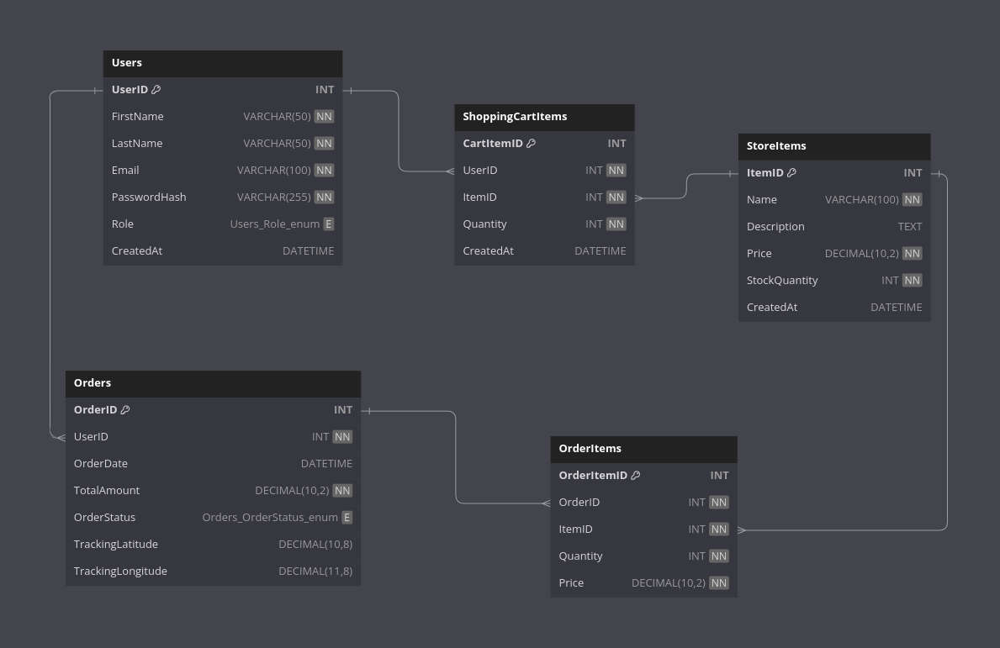

# Data model

The Online Shop schema is designed to support the functionality of an e-commerce platform. It consists of five main tables:

## Description

* Users: Stores user information, including names, email, hashed passwords, and roles (customer, admin, or courier). It distinguishes between different types of users for permissions and functionality.

* StoreItems: Contains details about items available in the shop.

* ShoppingCartItems: Tracks the items added to shopping carts, linking them to a user.

* Orders: Records information about purchases, including the user who placed the order, total amount, status (e.g., Pending, Shipped, Delivered). The tracking coordinates display current exact location of the package.

* OrderItems: Links specific items to orders, recording the quantity and price at the time of purchase, establishing a one-to-many relationship with the Orders table.

# Data retention policy

| **Table**            | **Data Type**                    | **Retention Period**           | **Reason for Retention**          |
|----------------------|----------------------------------|--------------------------------|-----------------------------------|
| **Users**            | User account data (e.g., name, email) | Active user: Indefinitely Inactive user: 3 years from last login | Operational and legal requirements for record-keeping. |
|                      | PasswordHash                     | Indefinitely                   | Essential for authentication.     |
| **StoreItems**       | Item details (e.g., name, description, price) | Indefinitely                   | Product records for historical and business purposes. |
|                      | StockQuantity                    | Until updated or product discontinued | Operational purposes.             |
| **ShoppingCartItems**| Temporary cart items linked to a user | 30 days from creation date or upon checkout | Temporary data, removed after inactivity. |
| **Orders**           | Order information (e.g., total amount, status) | 7 years from the order date     | Legal compliance (e.g., tax and audit). |
|                      | Tracking coordinates (latitude, longitude) | 30 days after order delivery    | Privacy concerns; no longer needed post-delivery. |
| **OrderItems**       | Items in an order               | 7 years from the order date     | Required for audit trails and legal compliance. |

