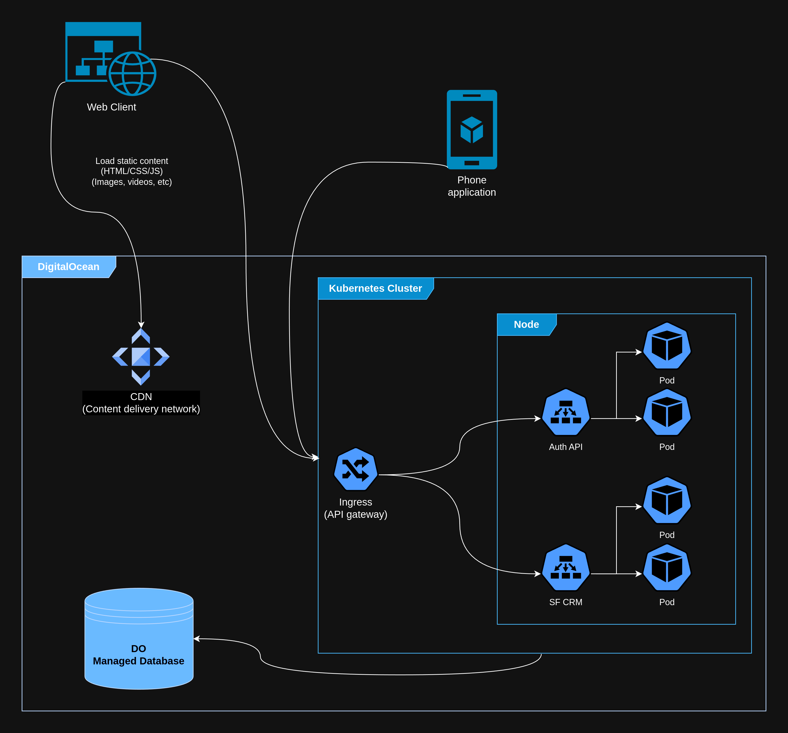

# Deployment model of ProjectSO

# Description

This deployment model represents a web application architecture hosted on DigitalOcean with the following components:

1. **Web Client**:
The user-facing interface accessed through a web browser.
Static assets like HTML, CSS, JavaScript, images, and videos are loaded from a Content Delivery Network (CDN) to optimize performance.

2. **Phone Application**:
A mobile application that interacts with the backend services for Courier functionality.
It communicates with the backend APIs hosted in the Kubernetes cluster.

3. **Content Delivery Network (CDN)**:
A distributed network of servers that delivers static assets quickly to the client by caching content closer to the user.

4. **Kubernetes Cluster**: Serves as the main infrastructure for managing backend services and applications. Contains the following components:
    1. **Ingress (API Gateway)**:
Handles incoming API requests from both the web client and the phone application. Routes requests to the appropriate services within the cluster.
    2. **Node**: Represents a physical or virtual machine in the cluster running multiple pods.
    3. Pods: Smallest deployable units in Kubernetes, each running a specific service:
        1. **Auth API**: Handles authentication and authorization logic.
        2. **SF CRM**: Main application server.

5. **DigitalOcean Managed Database**:
A database service that stores application data. It is connected to the backend services via secure database queries.

# Interaction Flow

The web client and phone application send requests, with static assets fetched from the CDN.
Dynamic requests are routed through the Ingress (API Gateway) in the Kubernetes cluster.
The gateway forwards requests to specific pods (e.g., Auth API or SF CRM).
Backend services interact with the DigitalOcean Managed Database for data storage and retrieval.
