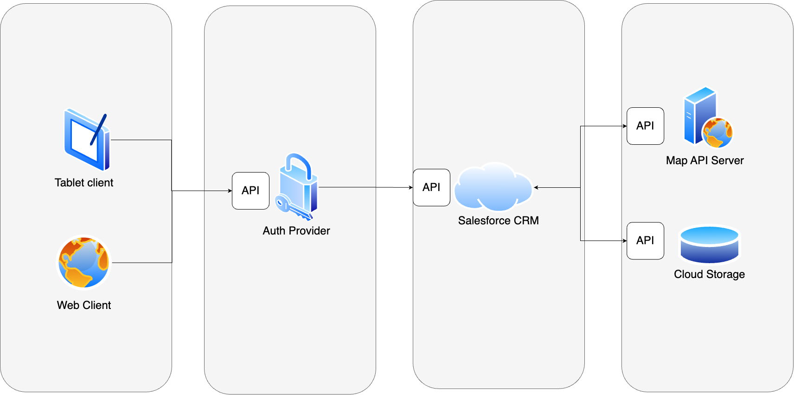

# Documentation

## High-level architecture

## Documentation files in this directory

Detailed information on specific topics about the project can be found here:

* [Software Requirements Specification](SRS.md)
* [Concurrency (Code) flows](FLOWS.md)
* [Data model](DataModel.md)
* [Resiliency](Resiliency.md)
* [Threat Model Diagram and Mitigation](ThreatModelAndMitigation.md)
* [Deployment model](DeploymentModel.md)
* [Functional metrics](FuncMetrics.md)
* [Monitoring metrics](MonitoringMetrics.md)
