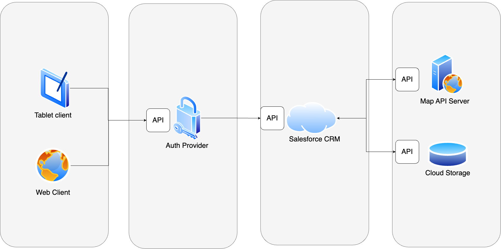

# For ProjectSO

Created and maintained by Stepan Halaiko & Oles Pankiv

## Introduction

The product is an Internet Shop that features a user-friendly website and a desktop application, designed to facilitate online shopping and enhance the customer experience. Key functionalities include:

* Product Catalog: A comprehensive display of available products, with detailed descriptions, pricing, and images.
* Shopping Cart: A feature allowing users to add, remove, and modify products before checkout.
* Order Management: Users can track their purchase delivery in real-time via an integrated live map feature, providing updates on the delivery status and estimated arrival times.
* Salesforce Integration: The system connects with Salesforce through an API, ensuring seamless management of customer data, order processing, and inventory tracking.
* User Accounts: Customers can create and manage their accounts to view order history, manage payment methods, and save preferences.

## High-level architecture

## Documentation

Project documentation files:

* [Software Requirements Specification](SRS.md)
* [Concurrency (Code) flows](FLOWS.md)
* [Data model](DataModel.md)
* [Resiliency](Resiliency.md)
* [Threat Model Diagram and Mitigation](ThreatModelAndMitigation.md)
* [Deployment model](DeploymentModel.md)
* [Functional metrics](FuncMetrics.md)
* [Monitoring metrics](MonitoringMetrics.md)
