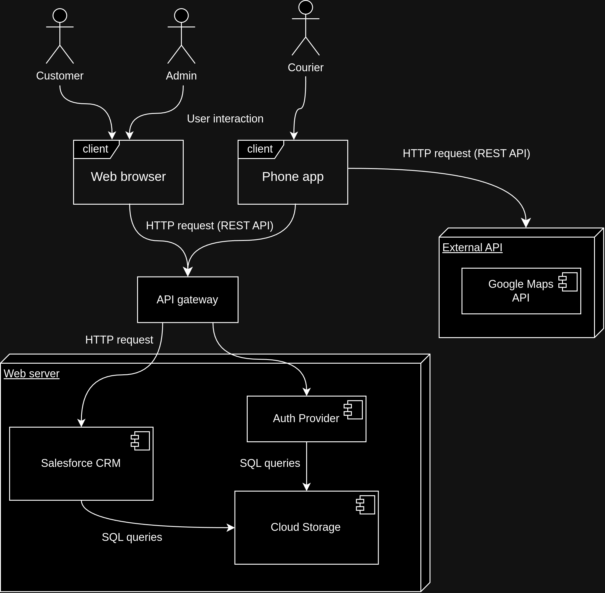

# Resiliency model

## Component Interaction Diagram (CID )

The Component Interaction Diagram (CID) is displaying the interaction between various components of the ProjectSO system.

## RMA workbook

### Interactions

| **Interaction ID** | **From**       | **To**          | **Description**            |
|---|------------|------------|-------------------------------------------------------|
| 1 | User | Web/Phone Client | User interacts with the website or smartphone application |
| 2 | Web/Phone Client | API gateway | Web/Phone client sends requests to the API gateway This service routes requests to the corresponding service, balances load between multiple instances and does other proxy actions like rate limiting |
| 3 | Web/Phone Client | Auth API(via API gateway) | Client sends requests to the Auth API in order to authenticate the user, change his password or generate one-time token for a "Forgot password" sequence |
| 4 | Auth API | Cloud Storage | Auth API queries and updates user information related to auth (identification, active tokens, active sessions, password hash) |
| 5 | Web/Phone Client | SF CRM | User makes a request to the SF SRM  |
| 6 | SF CRM | Cloud Storage | SF CRM makes a request to the Cloud Storage |
| 7 | Phone client | Google Maps API |  |

### RMA

RMA Workbook provides detailed information on system interactions, possible points of failure, and corresponding actions for maintaining the reliability, maintainability, and availability of the CafeLAutomation system.

| **Interaction ID** | **Possible Failure**       | **Description**          | **Response/Triggered Action** |
|---|------------|--------------------------------------------------|----------------------------------------|
| 1 | Internal error (response 5xx) | The back-end application fails to handle the request due to an internal error or a deployment issue | 1) log incident  2) provide user with incident ID  3) if too many error requests:  3.1) kill and restart service that causes the error  3.2) notify SA   4) if the issue was caused by a recent deployment, then roll-back to stable release  |
| 1 | Request timeout | The web server takes too long to respond to user interaction due to high traffic or system overload | 1) notify user about the delay  2) re-try request in background automatically  3) the infrastructure manager notices the high load and automatically allocates more resources to the service  
| 1 | Too many requests | The user is making too many (possibly unnecessary) requests | Slow down the UI, increase delay for request handling. In some cases display "System is busy" message to indicate to the user that he is overloading the system |
| 1 | Internet connection lost | The user lost connection to the internet/application | Display a user-friendly message about the connectivity issue. Re-try periodically to connect to the back-end |
| 2 | Service unknown | Client provided wrong service name | Return 5xx error. Report incident to SA since this might be a deployment issue. |
| 2 | Too many requests from the same source | One specific client is making unusually large amount of requests | Add artificial delay to request handling until the load descreases |
| 3 | Too many login re-tries | A user is making too many login requests | 1) report incident  2) block account access to the "Auth" service for a certain time period  3) inform user about the incident via email |
| 3 | "Forgot password" token expired | "Auth" service received a request with an expired "forgot password" token. | Return 4xx code. |
| 4 | Database request failure | Database fails to return requested data due to a connection issue or resource unavailability | Re-try query a few times. If unsuccessful return 5xx. |
| 4 | Long response time | The database is responding very slow to requests | Report to SA. Notify infrastructure manager to possibly increase DB instances |
| 5 | Too many requests from the same source | One specific client is making unusually large amount of requests | Add artificial delay to request handling until the load descreases |
| 6 | Empty response or error during request | The SF application can't access data from the database due to some internal issue | Re-try request and if unsuccuessful then report to SA
| 7 | Google Maps API access | Failure to authenticate to Google API | Use back-up option for courier navigation: 1) use other Map API providers  2) open navigation in an external (different) application |

\*Acronyms used

* SA - system admimistrator
* SF - SalesForce CRM
