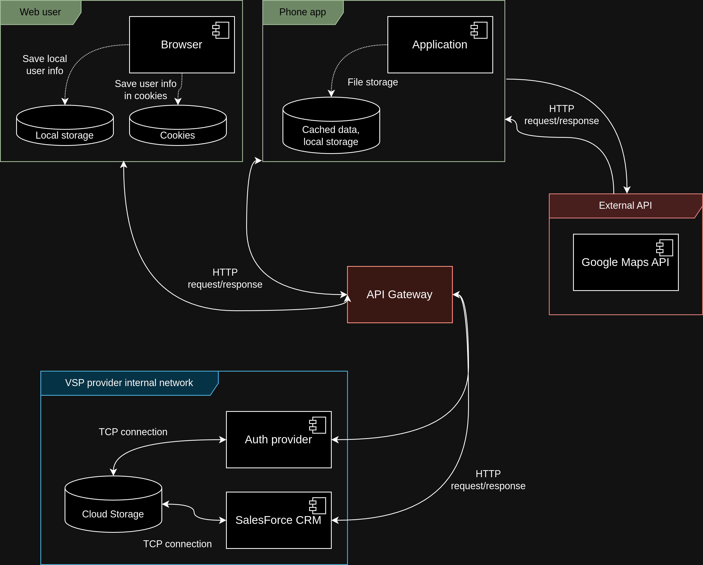

# Threat Model Diagram

# Possible threats and mitigation plan

| **#** | **Threat** | **Category** | **Description** | **Interaction** | **Mitigation Plann** |
|---|---|---|---|---|---|
| 1 | API Gateway Exploitation | Single point of failure | Client -> API gateway | The single API gateway may become a single point of failure and an attack vector for unauthorized access or DDoS attacks. | 1. Implement rate limiting and throttling to prevent abuse of the gateway.  2. Use a load balancer and deploy multiple instances of the API gateway to avoid single points of failure |
| 2 | Data breach | Elevation of Privilege | The "Auth" service has excessive access to the user database that contains both security data and personal data. | Client -> Auth API (via API gateway) | Create separate database for "Auth API" |
| 3 | Database credentials breach | Credentials breach | Credentials to the application database are stored in the application release package | Client -> SF CRM -> Database | Store API keys, database credentials, and other secrets in a secure vault (e.g., HashiCorp Vault, AWS Secrets Manager) |
| 4     | Insecure API Communications | Data interception | APIs might be vulnerable to eavesdropping or tampering if data is transmitted without encryption. | Client -> API Gateway -> SF CRM | 1. Enforce HTTPS (TLS) for all API communications.  2. Use mutual TLS or API keys for internal microservice communication |
| 5     | Unsecured Android Application | Mobile app vulnerability | Reverse engineering or hardcoded sensitive data in the Android app could expose the application to attacks. | Android App -> API Gateway  | 1. Obfuscate the Android app code.  2. Use Android Keystore for securely storing sensitive data.  3. Avoid embedding sensitive credentials (e.g., API keys) in the app |
| 6     | DDoS Attacks             | Availability risk          | A high volume of malicious traffic could overwhelm the system, causing downtime. | Client -> API Gateway        | 1. Deploy cloud-based DDoS protection (e.g., AWS Shield, Cloudflare).  2. Implement rate limiting and anomaly detection.  3. Use autoscaling to handle spikes |
| 7     | Cross-Site Scripting (XSS) | Client-side vulnerability | Attackers could inject malicious scripts into the web application, compromising user data. | Web App -> API Gateway       | 1. Validate and sanitize user inputs.  2. Use Content Security Policy (CSP) headers.  3. Escape special characters in dynamic content |
| 8    | Inadequate Logging and Monitoring | Incident detection | Insufficient monitoring could delay detection of security breaches or system failures. | All interactions             | 1. Centralize logging with tools like ELK stack.  2. Set up real-time alerts for suspicious activities |
| 9 | Authentication Bypass | Elevation of Privilege | Attacker bypasses authentication service | API gateway -> Auth service | 1. Implement JWT tokens  2. Strong session management  3. Multi-factor authentication - Rate limiting |
| 10 | Session Hijacking | Spoofing | Unauthorized access or misuse of user session tokens leading to session hijacking | 1) Secure cookies: Use HttpOnly, Secure, and SameSite attributes to protect cookies.  2) Secure session management: Ensure sessions are safely created, managed, and terminated |
